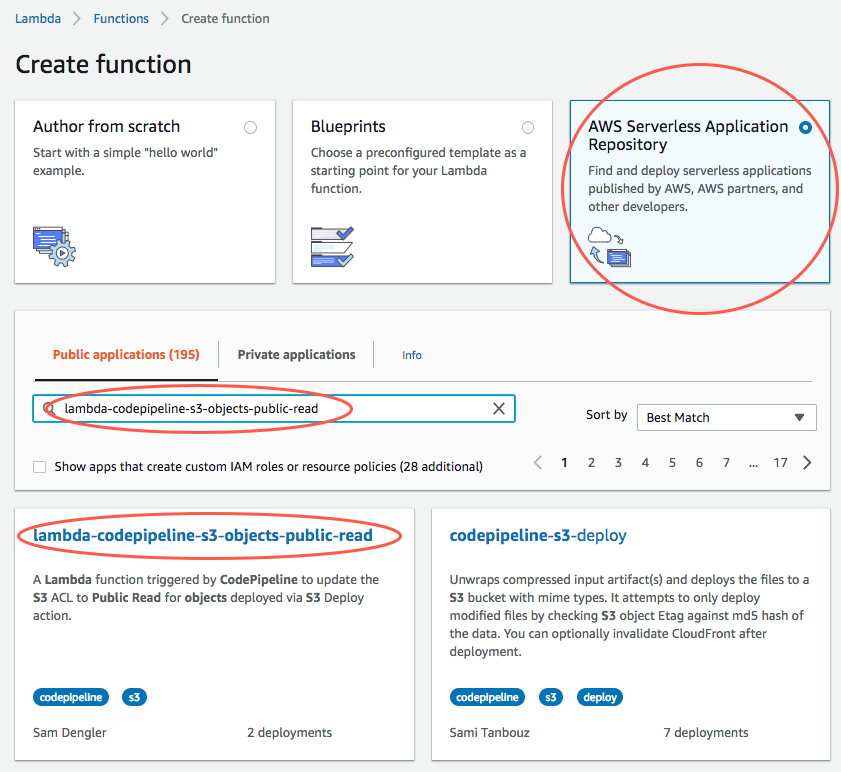
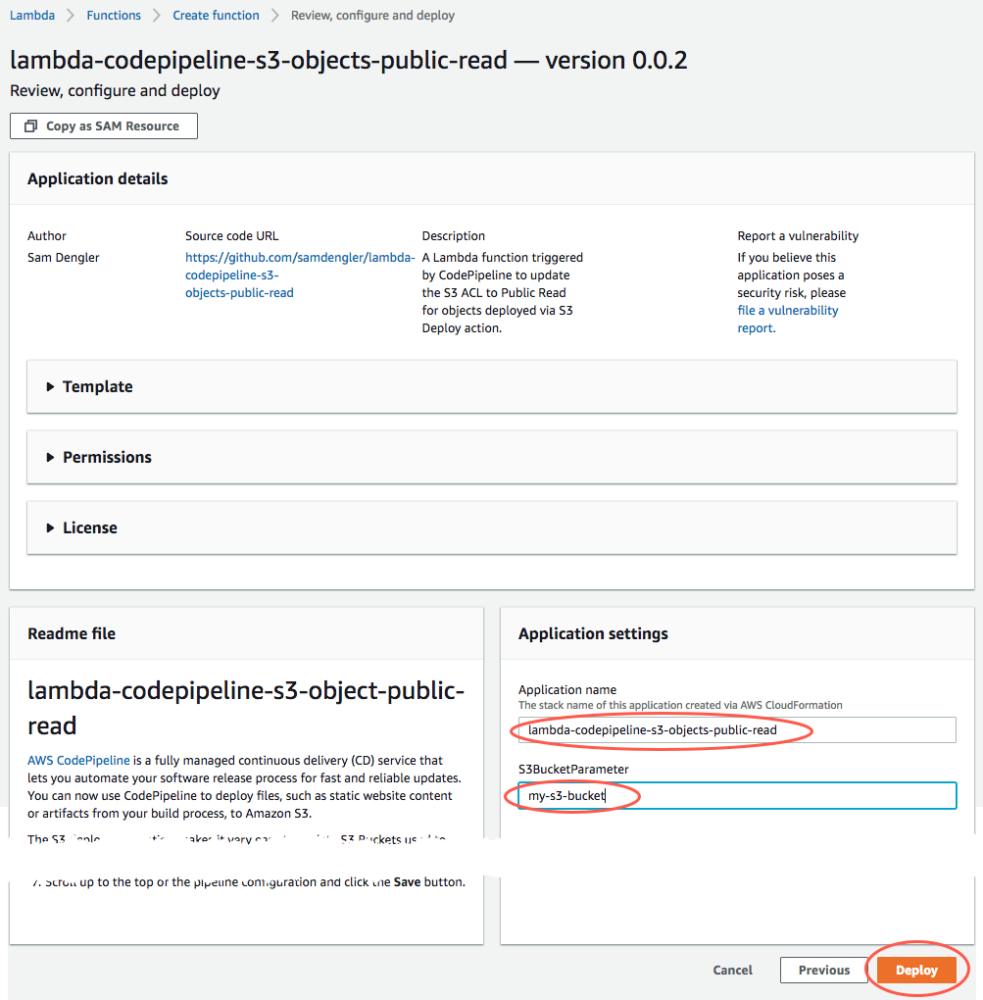
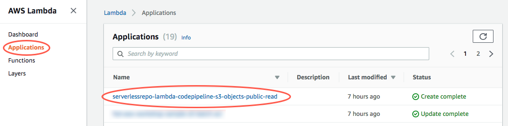
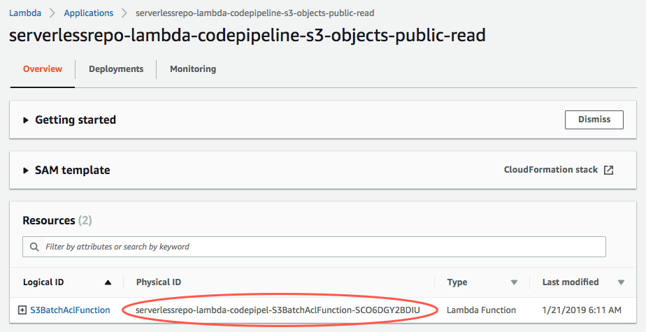
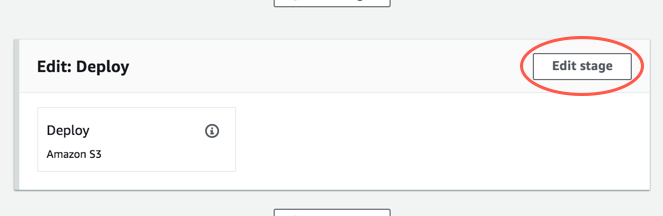
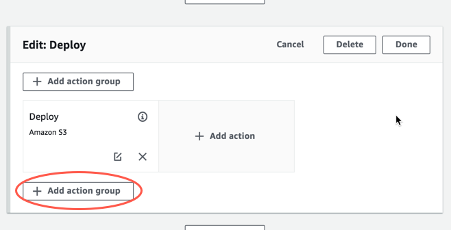
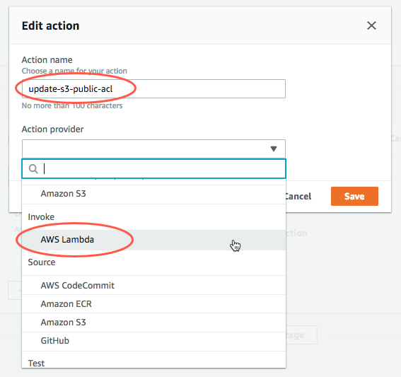
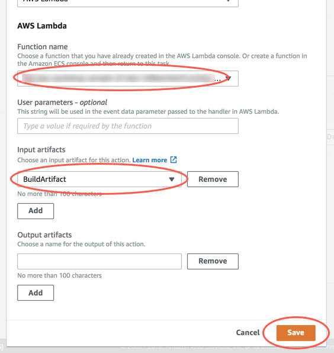
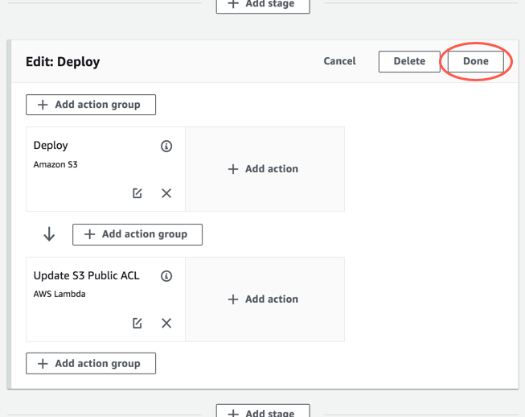

# codepipeline-s3-objects-public-read

A CASE (copy and steal everything!!! ;-) ) study from [Sam Dengler's original](https://github.com/samdengler/codepipeline-s3-objects-public-read) . Added the environment variable 'BUILD_ARTIFACT'.

[AWS CodePipeline](https://aws.amazon.com/codepipeline/) is a fully managed continuous delivery (CD) service that lets you automate your software release process for fast and reliable updates. You can now use CodePipeline to deploy files, such as static website content or artifacts from your build process, to Amazon S3.

The S3 deployment action makes it very easy to update S3 Buckets used to host static websites, however the objects deployed do not have Public Read Access.  In cases where the S3 Bucket policy does no allow Public Read Access, this prevents users from accessing the website content.

When invoked by CodePipeline following a successful deployment to S3, the Lambda function builds a list of objects from the BuildArtifact and updates the ACLs for each to have Public Read Access.

```bash
.
├── LICENSE.txt              <-- License file
├── README.md                <-- This instructions file
├── app                      <-- Source code for a lambda function
│   ├── index.js             <-- Lambda function code
│   ├── package.json         <-- Node dependencies
│   └── package-lock.json    <-- Node dependencies lock
└── template.yaml            <-- SAM template
```
## Instructions

[Installing the Lambda Function from the Serverless Application Repository](#installing-the-function-from-the-serverless-application-repository)      
[Configuring CodePipeline to use the Lambda Function](#configuring-codepipeline-to-use-the-function)

---

## Installing the Lambda Function from the Serverless Application Repository

1. Click the **Create Function** button in the Lambda Console.

2. Enter `codepipeline-s3-objects-public-read` in the search box and select the **codepipeline-s3-objects-public-read** application.

    

3. Enter an Application name (or keep the default) and the S3 Bucket name used to target the deployment in CodePipeline.  Scroll to the bottom and click **Deploy**.

    

4. After the deployment is complete, click **Applications** in the left navigation and select the Application name used when creating the Application.

    

5. Make note of the **Physical ID** for the **S3BatchAclFunction**.  You will use this when configuring the [CodePipeline pipeline](#configuring-codepipeline-to-use-the-function).

    


## Configuring CodePipeline to use the Lambda Function

1. Click the **Edit** button next to the pipeline name:

    

2. Scroll down to the Deploy stage and click the **Edit** button.

    

3. Click the **Add action group** button.

    

4. Type an **Action name** and select **AWS Lambda** from the **Action provider** list.

    

5. In the AWS Lambda section, select the name of this Function that you've uploaded to your AWS account for **Function name**, select the same **Input artifact** used to deploy to S3, and click **Save**.

    

6. Click the **Done** button in the Deploy stage.

    

7. Scroll up to the top of the pipeline configuration and click the **Save** button.

    

8. Done!  The next time that pipeline is executed, the BuildArtifact objects deployed to S3 will be updated with Public Read Access.

